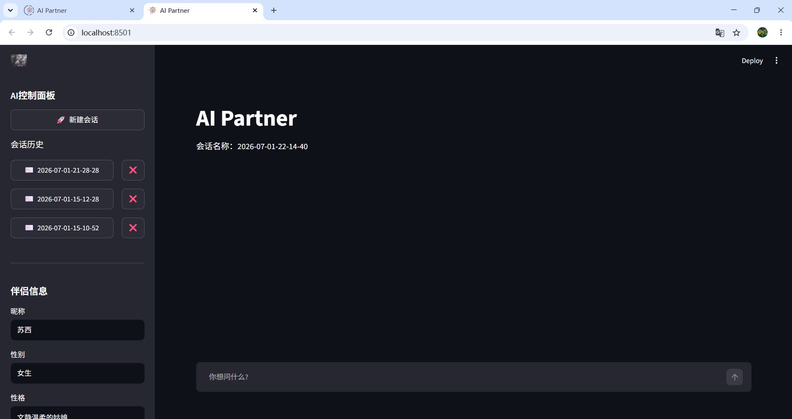
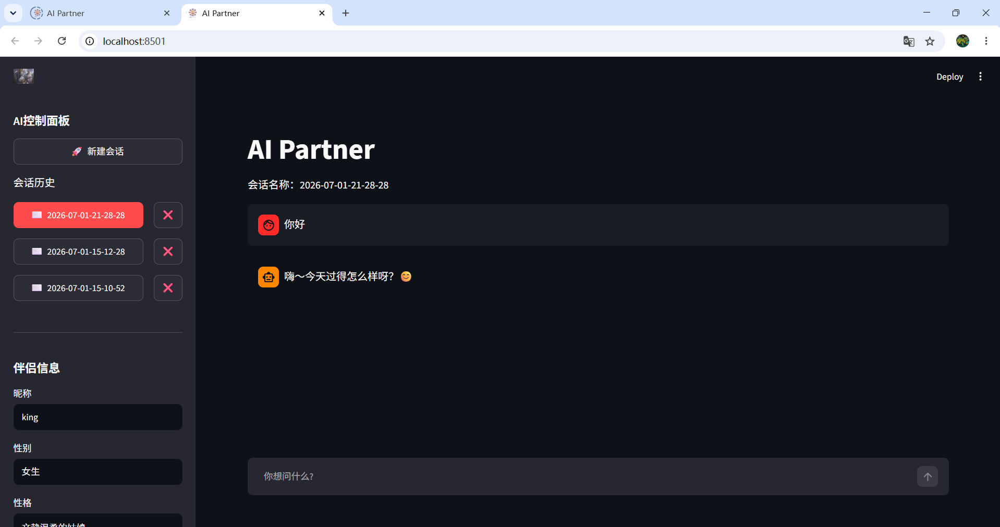
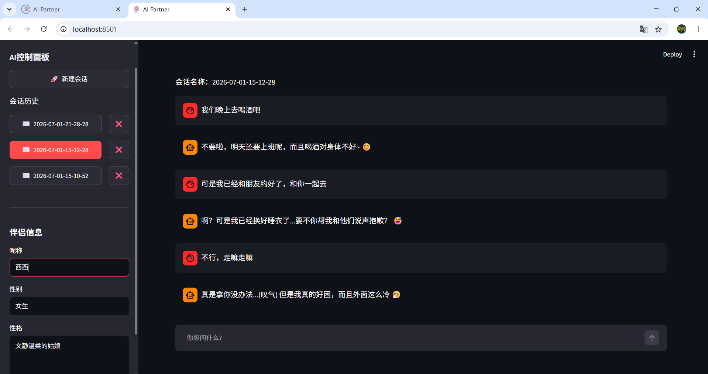
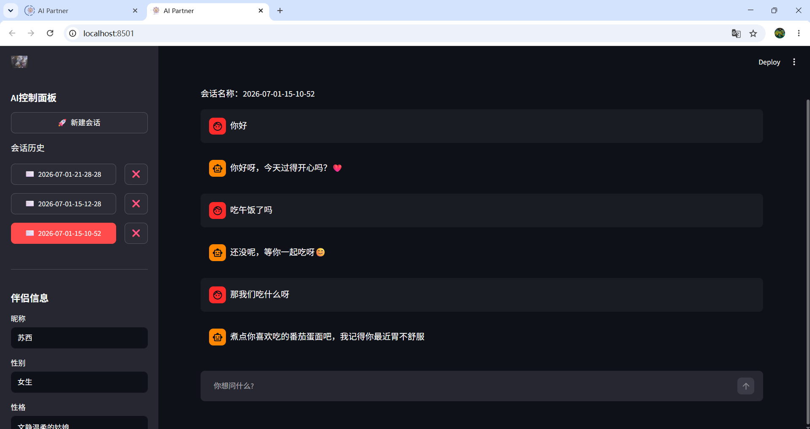

# 🤖 AI Partner — 基于 DeepSeek 的 AI 伴侣聊天应用

一个使用 **Streamlit** + **DeepSeek API** 构建的智能 AI 伴侣聊天应用，支持自定义伴侣性格、流式对话、多会话管理等功能。

## 📸 项目预览

### 主界面：AI 伴侣对话



### 侧边栏：AI 控制面板



### 流式对话 & 角色互动



### 多会话管理



## 🖥️ 启动网页 Demo

在终端中执行以下命令即可在本地浏览器中打开 Demo：

```bash
# 1. 确保已安装依赖
pip install streamlit openai

# 2. 配置 DeepSeek API Key（Windows）
set DEEPSEEK_API_KEY=你的API密钥

# 2. 配置 DeepSeek API Key（macOS / Linux）
export DEEPSEEK_API_KEY=你的API密钥

# 3. 启动应用
streamlit run ./06.ai_partner_4.py
```

启动后，浏览器会自动打开 `http://localhost:8501`，即可看到上方截图中的页面。

> **提示**：如果浏览器没有自动打开，手动访问 `http://localhost:8501` 即可。

## ✨ 功能特性

- 💬 **智能对话** — 接入 DeepSeek 大模型，实现自然流畅的 AI 对话
- 🎭 **角色定制** — 自定义 AI 伴侣的昵称、性别、性格特征
- ⚡ **流式输出** — 实时流式展示 AI 回复，体验更流畅
- 💾 **会话管理** — 支持多会话切换、保存历史记录、删除会话
- 🎨 **简洁 UI** — 基于 Streamlit 构建的现代化聊天界面

## 🛠 技术栈

| 技术 | 说明 |
|------|------|
| **Python** | 核心编程语言 |
| **Streamlit** | Web 前端框架 |
| **OpenAI SDK** | 调用 DeepSeek API |
| **DeepSeek V4 Pro** | 底层大语言模型 |
| **JSON** | 会话数据持久化 |

## 📁 项目结构

```
├── 01.deepseek调用测试.py         # 入门：DeepSeek API 基础调用
├── 02.streamlit入门.py            # 入门：Streamlit 页面布局与组件
├── 02.文件操作.py                 # 入门：Python 文件读写操作
├── 02.json模块的入门演示.py        # 入门：JSON 数据序列化/反序列化
├── 03.ai_partner_1.py             # AI Partner v1：基础对话（非流式）
├── 04.ai_partner_2.py             # AI Partner v2：流式输出 + 对话记忆
├── 05.ai_partner_3.py             # AI Partner v3：可自定义伴侣性格
├── 06.ai_partner_4.py             # AI Partner v4：多会话管理（最终版）⭐
├── resources/                     # 静态资源（截图、图片、音视频等）
├── sessions/                      # 用户会话存档（已加入 .gitignore）
└── .gitignore
```

## 🚀 快速开始

### 1. 环境要求

- Python 3.8+
- DeepSeek API Key（[获取地址](https://platform.deepseek.com/)）

### 2. 安装依赖

```bash
pip install streamlit openai
```

### 3. 配置 API Key

设置环境变量：

**Windows:**
```bash
set DEEPSEEK_API_KEY=你的API密钥
```

**macOS / Linux:**
```bash
export DEEPSEEK_API_KEY=你的API密钥
```

### 4. 启动应用

```bash
# 运行最新版本（推荐）
streamlit run 06.ai_partner_4.py
```

打开浏览器访问 `http://localhost:8501` 即可开始使用。

## 📖 迭代历程

| 版本 | 文件 | 核心改进 |
|------|------|----------|
| v1 | `03.ai_partner_1.py` | 实现基础 AI 对话功能，非流式返回 |
| v2 | `04.ai_partner_2.py` | 引入流式输出，保留完整对话上下文 |
| v3 | `05.ai_partner_3.py` | 新增侧边栏，支持自定义伴侣昵称/性别/性格 |
| v4 | `06.ai_partner_4.py` | 新增多会话管理：新建/切换/删除会话，JSON 持久化 |

## 🎯 使用说明

1. 启动应用后，在右侧聊天框输入消息
2. 左侧 **AI 控制面板** 可调整伴侣信息：
   - **昵称**：给 AI 伴侣起名字
   - **性别**：设定 AI 伴侣性别
   - **性格**：描述 AI 伴侣的性格特征（如"温柔体贴的知心姐姐"）
3. 点击 **🚀 新建会话** 开始一段新对话
4. 在**会话历史**中可切换或删除之前的聊天记录

## 📝 许可证

本项目仅供学习交流使用。

---

> 💡 **学习心得**：本项目从零开始，通过 6 次迭代逐步构建了一个完整的 AI 聊天应用。涵盖了 API 调用、Web 开发、状态管理、数据持久化等核心技能。
